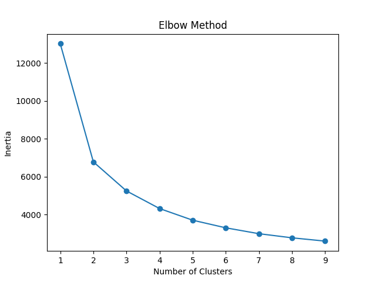
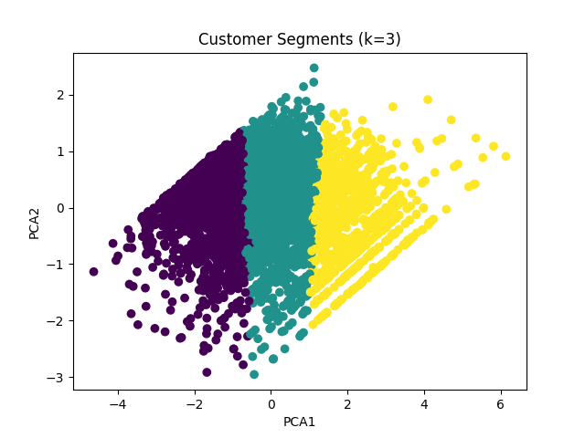
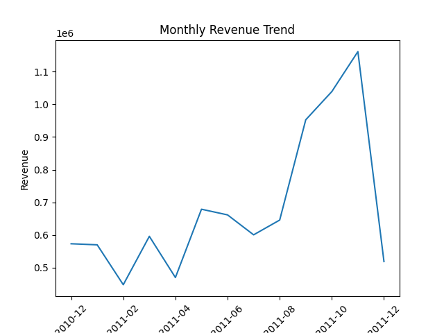

# Customer Segmentation using RFM & K-Means

##  Project Overview

This project focuses on segmenting customers based on their purchasing behavior using RFM (Recency, Frequency, Monetary) analysis and K-Means clustering.

The goal is to identify different customer groups and provide business insights to improve marketing strategies and revenue.

---

##  Dataset

* **Name:** Online Retail Dataset
* **Source:** Kaggle
* **Description:** Contains transactional data of an online retail store including invoice details, customer ID, product, quantity, price, and country.

---

##  Methodology

### 1. Data Cleaning

* Removed missing CustomerID values
* Removed negative or zero Quantity and UnitPrice
* Converted InvoiceDate to datetime

### 2. Exploratory Data Analysis (EDA)

* Identified top countries by revenue
* Analyzed monthly revenue trends
* Observed customer spending distribution

### 3. RFM Feature Engineering

* Recency: Days since last purchase
* Frequency: Number of transactions
* Monetary: Total spending

### 4. Data Transformation

* Applied log transformation to reduce skewness
* Used StandardScaler for feature scaling

### 5. Clustering

* Applied K-Means clustering
* Used Elbow Method and Silhouette Score for evaluation
* Compared k=2 and k=3

---

## Visualizations

### Elbow Method

### Customer Segmentation (k=3)

### Monthly Revenue Trend

##  Live Dashboard

[Click here to view the dashboard][https://appapppy-m8xe3crhzaxnekfehofnar.streamlit.app/#project-overview](https://appapppy-m8xe3crhzaxnekfehofnar.streamlit.app/#project-overview)

---

##  Results

* Cluster 0 → Low-value / inactive customers
* Cluster 1 → Medium-value customers
* Cluster 2 → High-value customers

Although k=2 provided better separation, k=3 was selected for better business interpretation.

---

##  Business Insights

* A small group of customers generates most of the revenue
* High-value customers should be retained through loyalty programs
* Medium-value customers can be targeted for upselling
* Low-value customers require re-engagement strategies

---

##  Future Improvements

* Try advanced clustering algorithms (DBSCAN, Hierarchical)
* Build customer lifetime value prediction model
* Develop an interactive dashboard

---

##  Tech Stack

* Python
* Pandas, NumPy
* Matplotlib, Seaborn
* Scikit-learn
* Streamlit

